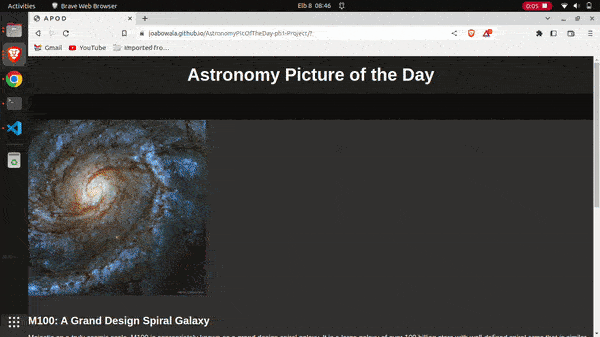

# AstronomyPicOfTheDay-ph1-Project (A P O D)
This is a simple web application that displays the Astronomy Picture of the Day from the NASA API. Users can also like the picture and leave comments on it.


## Description

This project displays the Astronomy Picture of the Day (APOD) retrieved from the NASA API. The page includes the APOD image, title, explanation, and date, along with a like button and a comments section.


## Getting Started

### Executing program

#1) Clone this repository.
```
git clone https://github.com/JoabOwala/apod.git

```


#2) Open the ```index.html``` file in your browser.

The web page will load and display the Astronomy Picture of the Day along with its title, explanation, and date. Users can like the picture by clicking on the "Like" button, and the number of likes will be displayed next to the button.

Users can also leave comments on the picture by filling out the comment form at the bottom of the page. Simply enter your name and comment in the appropriate fields and click the "Submit" button. Your comment will be added to the list of comments below the form


#3) 




### How to Access online

* Follow link => https://joabowala.github.io/AstronomyPicOfTheDay-ph1-Project/


### Technologies

* HTML
* CSS
* JavaScript

### API

This project uses the NASA API to fetch the Astronomy Picture of the Day. You can get an API key by following the instructions on the NASA API website.

* Functionality
The JavaScript code fetches the APOD from the NASA API and displays it on the page. The like button increments a counter each time it is clicked. The comments form allows users to submit a name and comment, which are added to the comment section below.

* Styling
The page is styled using custom CSS. The font family used is Montserrat. The color scheme is dark with white and orange accents.


## Help

Depending on the quality of the image and internet speeds, loading times may differ.
For questions write an email to owalajoab@gmail.com


## Authors
This project was created by Joab Owala
[https://github.com/JoabOwala](owalajoab@gmail.com)


## Version History

* 0.1
    * Initial Release

## License

This project is licensed under the MIT License - see the LICENSE.md file for details

## Acknowledgments
* https://api.nasa.gov/
Inspiration, code snippets.
* freefrontend.com/bootstrap-code-examples/
* freefrontend.com/css-cards/
* Bootstrap framework 